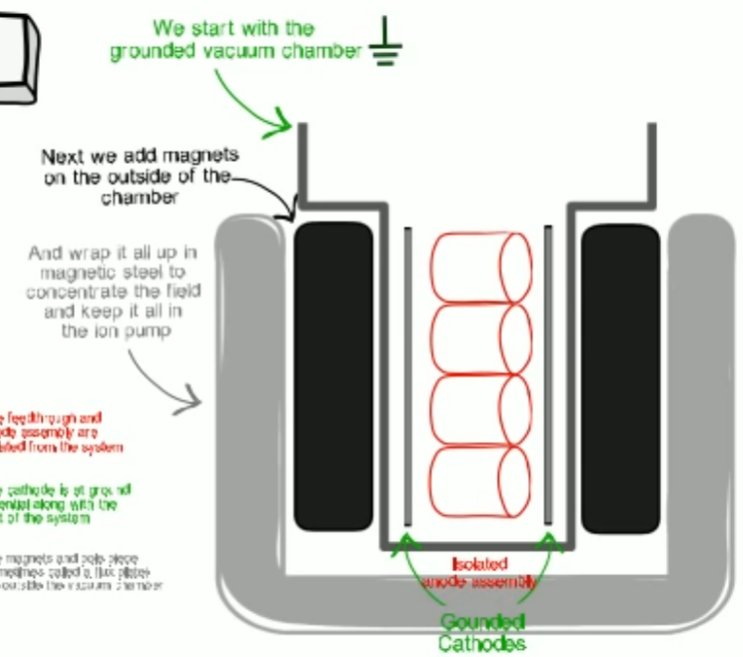
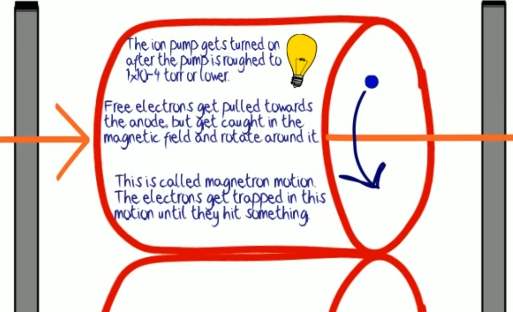
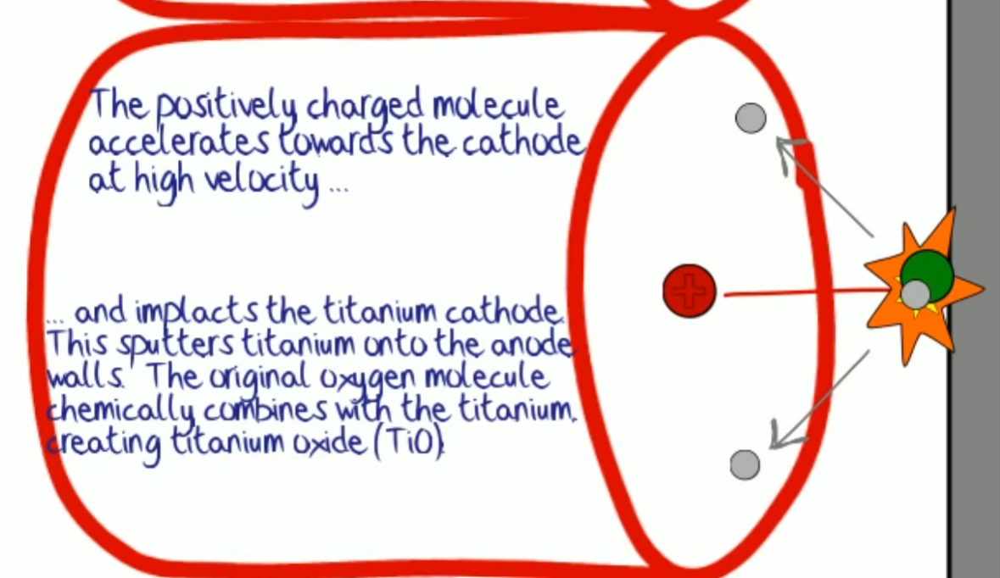
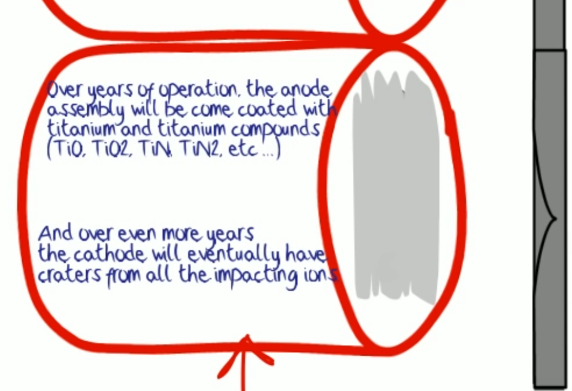

Ion pump 동작: 약 $10^{-4}$ torr 보다 낮은 기압에서 부터 동작시켜야 한다.

내부에 원통형 anode 와, 티타늄으로 이뤄진 cathode 가 있다. 겉에는 강한 자석이 있어서 내부 원통에 자기장을 만든다.

원통 내부에서 전자는 자기장때문에 빙글빙글 돌다가 가스랑 충돌한다.

충돌로 인해 가스는 이온화 되고, 이온은 cathode 에 부딪혀 sputtering 을 일으킨다. 튀어나온 Ti 입자는 산소 등과 반응해 산화물을 형성한다.

이온펌프를 쓰다보면 sputtering 으로 cathode 가 움푹 파이게 되고, 원통 안쪽에 은색 티타늄 산화물이 붙게 된다.

## References

https://www.youtube.com/watch?v=_snzYepQTjI