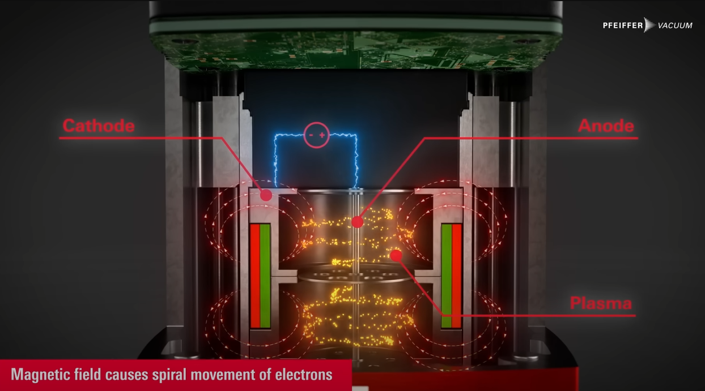
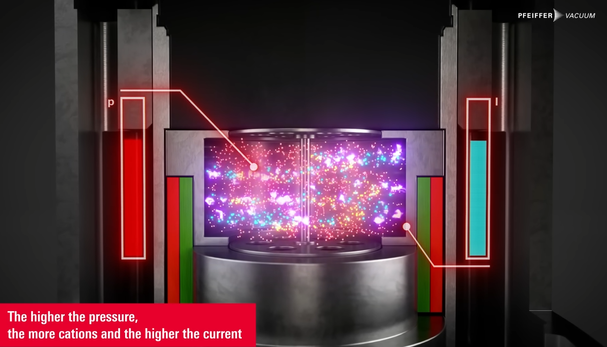
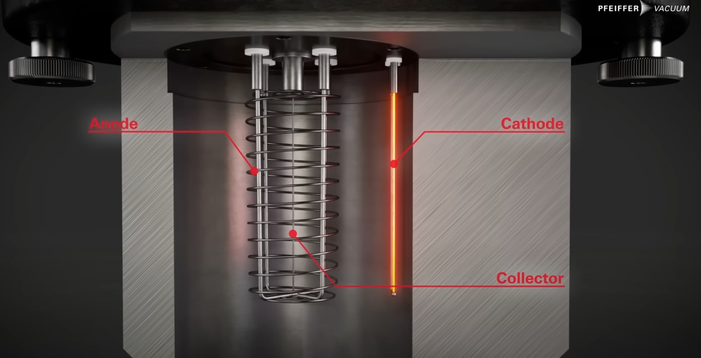
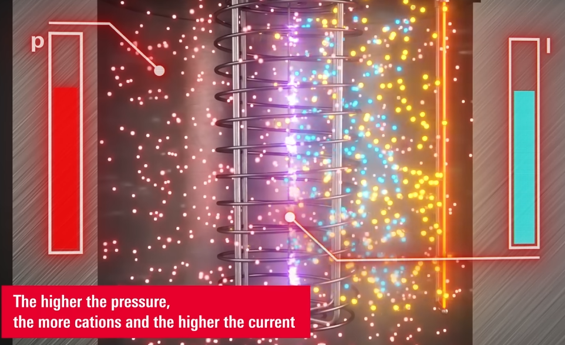

# 진공 측정

## Cold cathode ionization

Peanning gauge 라고 불리는 것.

두개의 전극에 3.2kV 와 1.6kV 정도의 강한 전압을 걸어줘서 전기장을 만들고, 전기장 사이에 강한 자기장을 걸면 전자가 전극 사이를 나선형으로 움직인다. 전자는 가스와 부딪혀서 이온화 시키고, 이온화로 인한 전류를 측정하면 진공도를 알 수 있다.

가스 종류에 따라 다르지만, PR35 Penning gauge 는 0.1mA 가 $10^{-2}$ mbar 쯤이고, 0.01mA 가 $10^{-5}$ mbar 쯤이다. 가스 종류에 따른 차이는 correction factor 를 고려하면 된다.

sturdy 하고 easy to service 하지만, 측정 불확정도가 30 에서 50% 정도이다. 측정 가능 범위는 $10^{-2}$ mbar 에서 $10^{-9}$ mbar 정도이고, particle ionization 되는 정도는 입자의 밀도(압력)에 비례하기 때문에 $10^{-2}$ mbar 에서 $10^{-5}$ mbar 사이에서 작동을 시작하는게 좋다.

## Hot cathode ionization

뜨겁게 가열한 Cathode 에서 나온 전자가 gas 랑 부딪히면 가스가 이온화 되고, 이온화된 입자가 collector 에 부딪히면 전류가 생긴다. 전류에 따라 압력을 측정하는 장비.

측정 범위가 $10^{-2}$ mbar 에서 $10^{-11}$ mbar 로 넓고, 오차도 10% 정도로 작지만, filament 의 수명이 오염과 충격에 민감하다는 단점이 있다.

## Reference

https://www.youtube.com/watch?v=FIQQovDHmGY

https://www.leybold.com/en/knowledge/vacuum-fundamentals/vacuum-generation/ultra-and-extreme-high-vacuum

https://www.thinksrs.com/downloads/pdfs/applicationnotes/IG1hotapp.pdf